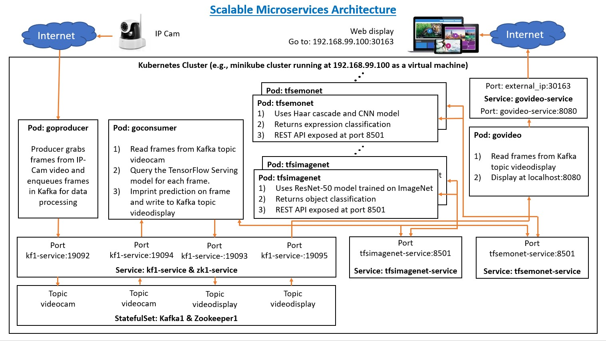
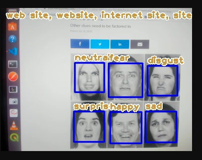

# Machine Learning Deployment Extended

In this project, we develop a real-time video analytics pipeline (i.e., machine learning on a video stream). Video will be ingested from IP cameras into a Kafka queue and processed by one or more machine learning models. The predictions are imprinted onto the frames. Processed frames are queued again into another Kafka topic and then broadcasted to the web for display. 

Microservices architecture is adopted, where all code is containerized using Dockers and orchestrated using Kubernetes.

The video analytics will focus on two machine learning models, namely:
1. object classification (similar to ImageNet), and 
1. human facial expression classification.

Both models will be deployed using TensorFlow Serving.

The following tools are used in this project:
+ Kubernetes
+ Docker
+ Golang
+ Kafka & Zookeeper
+ REST
+ TensorFlow Serving API

The complete system design and data flow of this project is illustrated by the following image.
 

A sample video output of the system running two tensorflow models, namely, object classification and human facial expression classification, is shown below.

See [website](https://adaickalavan.github.io/portfolio/machine_learning_deployment/) for more information.
